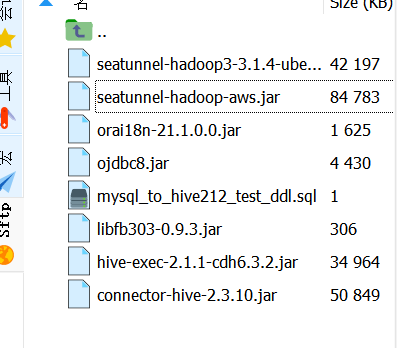
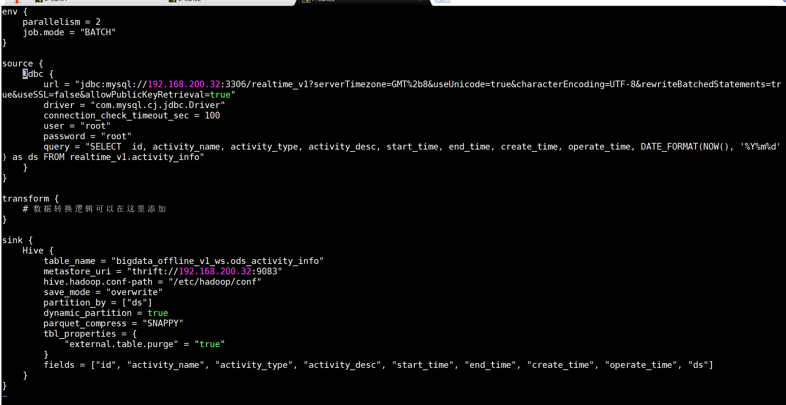
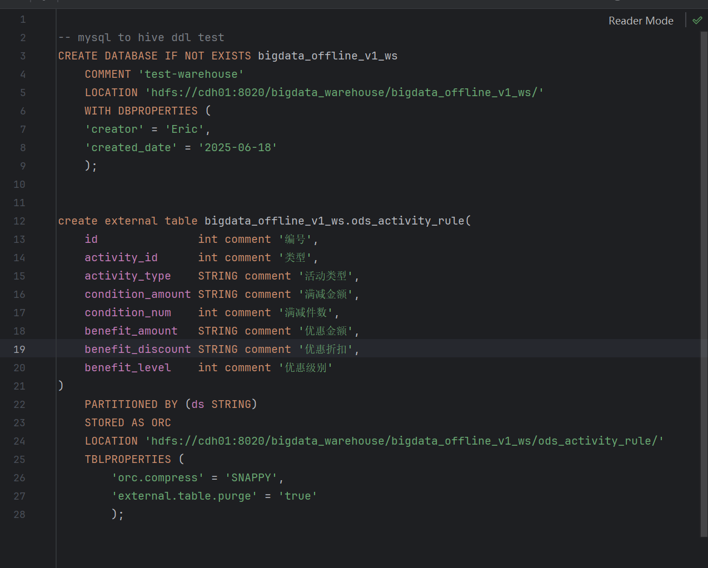
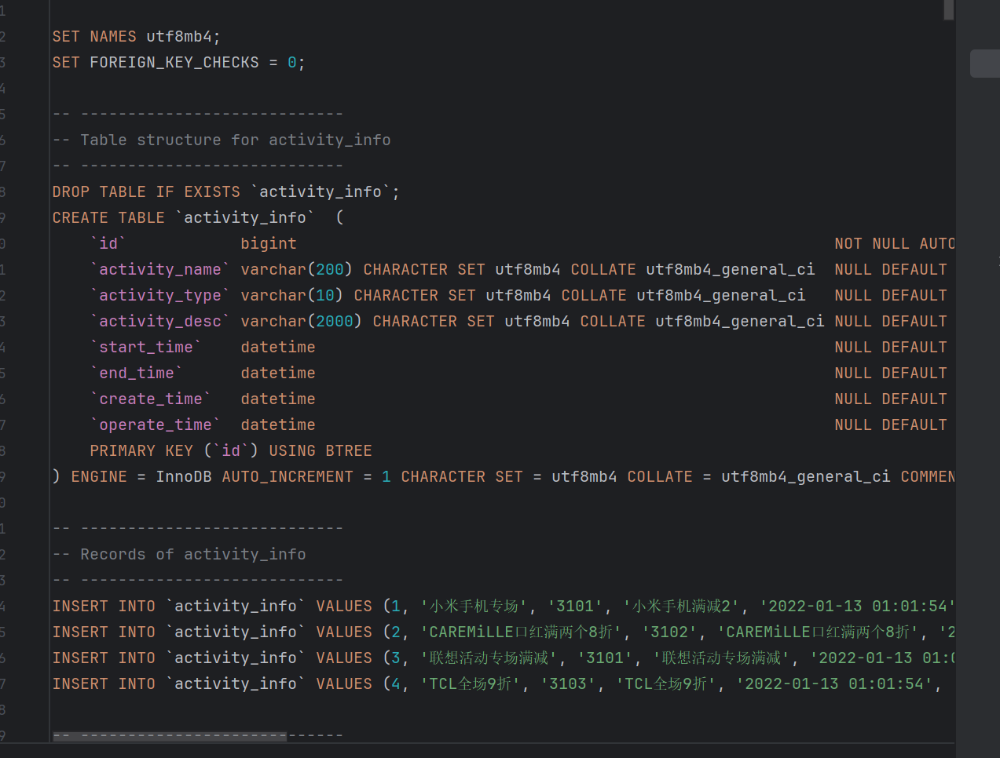
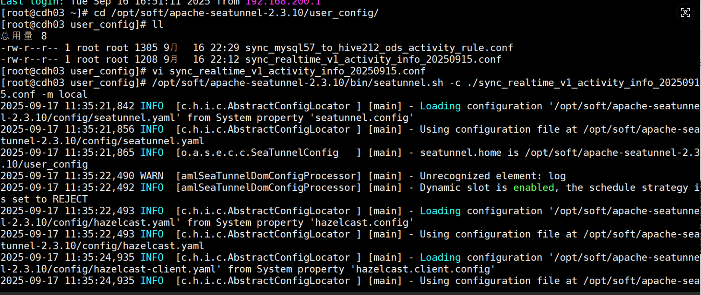
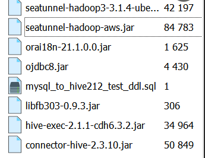
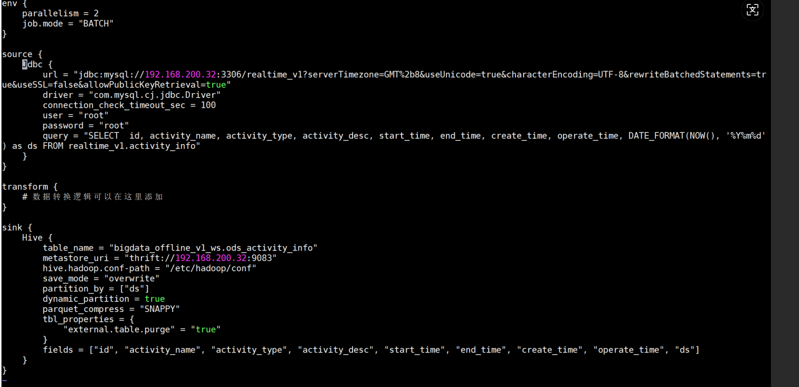
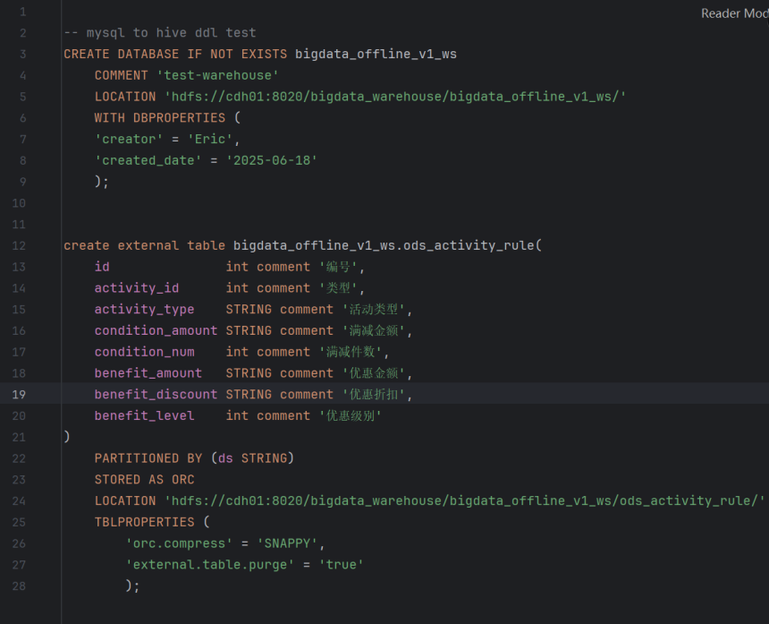
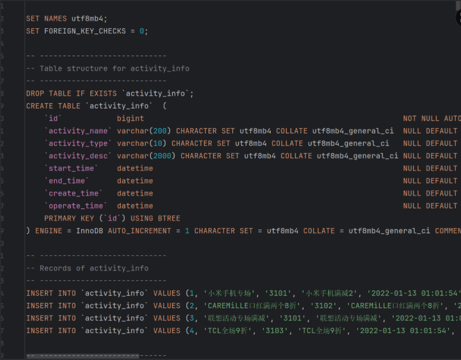
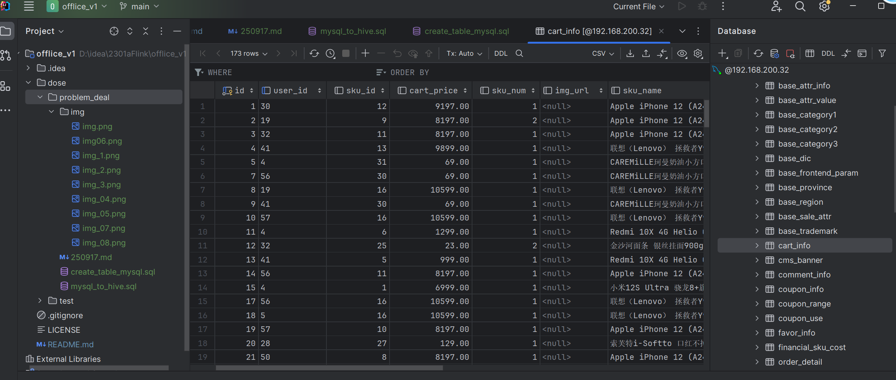

# 2025-09-17
>遇到的错误:
>在集群创建的时候出现了权限不够的问题
>
需要我们在Mobaxter中执行命令,增加用户读和写的权限。
给用户添加hdfs超级权限
>
运行出现这个读取zip文件错误
>
之后重新导入tar包，解压tar，重新运行还是没有改变,
说是maven中的没有jar包，之后导入
>
然后再返回到 /root/.m2/wrapper/dists/apache-maven-3.8.4-bin/52ccbt68d252mdldqsfsn03jlf/apache-maven-3.8.4/conf/
的settings.xml文件中添加
> aliyun仓库的配置,之后再重新运行,
> 成功之后就修改里面的配置了
> 然后就是测试同步
> 
> 测试连接看时候能够成功同步信息,
> 需要在lib中导入jar包
> 
> 然后测试连接成功之后在创建一个文件夹,里面创建一个conf文件,然后再编辑文件，
> 
> 创建hive和mysql，建表
>,建完之后在进行同步数据
> 同步成功